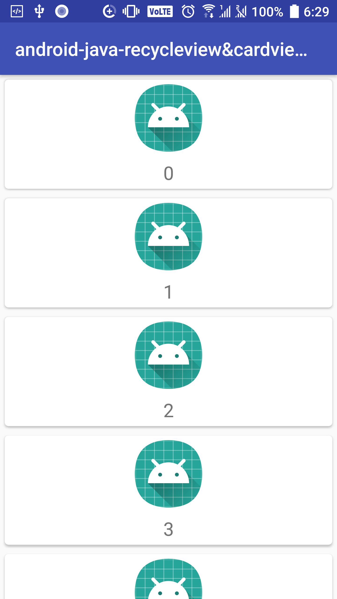

# RecyclerView & CardView Demo

https://developer.android.com/training/material/lists-cards.html

# RecyclerView
RecyclerView 提供下列內建的版面配置管理員(layout manager)：

+ [LinearLayoutManager](https://developer.android.com/reference/android/support/v7/widget/LinearLayoutManager.html) 在垂直或水平捲動清單中顯示項目。
+ [GridLayoutManager](https://developer.android.com/reference/android/support/v7/widget/GridLayoutManager.html) 會在網格中顯示項目。
+ [StaggeredGridLayoutManager](https://developer.android.com/reference/android/support/v7/widget/StaggeredGridLayoutManager.html) 會在交錯網格中顯示項目。


## 程式碼
### 1. 加入Gradle
 一開始需要在Gradle加入這2行
```gradle
  compile 'com.android.support:cardview-v7:21.0.+'
  compile 'com.android.support:recyclerview-v7:21.0.+'
```
後面的版本請根據appcompat版本作修改才可以正常運作
```gradle
def LibVersion="{26.1.0}"

implementation 'com.android.support:appcompat-v7:${LibVersion}'

dependencies {
    ...
    compile 'com.android.support:cardview-v7:${LibVersion}'
    compile 'com.android.support:recyclerview-v7:${LibVersion}'
}
```

### 2. 在xml加入RecyclerView
```xml
<?xml version="1.0" encoding="utf-8"?>
<LinearLayout xmlns:android="http://schemas.android.com/apk/res/android"
    android:layout_width="match_parent"
    android:layout_height="match_parent">

    <android.support.v7.widget.RecyclerView
        android:id="@+id/rv_my_recycleview"
        android:layout_width="match_parent"
        android:layout_height="match_parent" />
</LinearLayout>
```

### 3. 在activity加入RecyclerView
+ RecyclerView 
+ RecyclerView.Adapter (存放資料的容器(可以是普通array或者object))
+ RecyclerView.LayoutManager (設定recyclerView的顯示方式)
```java
public class MyActivity extends Activity {
    private RecyclerView mRecyclerView;
    private RecyclerView.Adapter mAdapter;
    private RecyclerView.LayoutManager mLayoutManager;

    @Override
    protected void onCreate(Bundle savedInstanceState) {
        super.onCreate(savedInstanceState);
        setContentView(R.layout.my_activity);
        mRecyclerView = (RecyclerView) findViewById(R.id.rv_my_recycleview);

        // use this setting to improve performance if you know that changes
        // in content do not change the layout size of the RecyclerView
        mRecyclerView.setHasFixedSize(true);

        // use a linear layout manager
        mLayoutManager = new LinearLayoutManager(this);
		
		// use a Grid Layout Manager
		// mLayoutManager = new GridLayoutManager(this,defaultSpanCount);
		// use a Staggered Grid layout manager
		// mLayoutManager = new StaggeredGridLayoutManager(defaultSpanCount,StaggeredGridLayoutManager.VERTICAL);
        mRecyclerView.setLayoutManager(mLayoutManager);

        // specify an adapter (see also next example)
        mAdapter = new MyAdapter(myDataset);
        mRecyclerView.setAdapter(mAdapter);
    }
    ...
}
```

### 4. 加入normal_item.xml
```xml
<?xml version="1.0" encoding="utf-8"?>
<RelativeLayout  xmlns:android="http://schemas.android.com/apk/res/android"
    xmlns:app="http://schemas.android.com/apk/res-auto"
    android:orientation="vertical"
    android:layout_margin="10dp"
    android:layout_width="match_parent"
    android:layout_height="wrap_content">
    <ImageView
        android:layout_centerVertical="true"
        android:id="@+id/info_img"
        android:layout_alignParentLeft="true"
        app:srcCompat="@mipmap/ic_launcher"
        android:layout_width="50dp"
        android:layout_height="50dp" />
    <TextView
        android:layout_marginLeft="10dp"
        android:layout_centerVertical="true"
        android:layout_toRightOf="@id/info_img"
        android:layout_alignParentRight="true"
        android:id="@+id/textView"
        android:layout_width="wrap_content"
        android:layout_height="wrap_content" />
</RelativeLayout>
```

### 5. 加入adapter (決定每行item的介面)

```java
public class MyAdapter extends RecyclerView.Adapter<MyAdapter.ViewHolder> {
	//Adapter class用於設定自身的adapter(customer view)
	private List<String> mDataset;  //資料集

	public class ViewHolder extends RecyclerView.ViewHolder {
		//ViewHolder class 主要是用於連接layout (每行item)
		public TextView mTextView;
		public ViewHolder(View v) {
			super(v);
			mTextView = (TextView)v.findViewById(R.id.textView);
		}
	}

	public MyAdapter(List<String> myDataset) {
		//constructors
		mDataset = myDataset;
	}

	@Override
	public MyAdapter.ViewHolder onCreateViewHolder(ViewGroup parent, int viewType) {
		View v = LayoutInflater.from(parent.getContext())
				.inflate(R.layout.normal_item, parent, false);
		ViewHolder vh = new ViewHolder(v);
		return vh;
	}

	@Override
	public void onBindViewHolder(ViewHolder holder,final int position) {
		//當物件顯示於畫面時被調用，可利用此方法更新該物件之內容。
		holder.mTextView.setText(mDataset.get(position));
		if(isStagger)
			holder.mTextView.setHeight(random(800,80));
	}

	@Override
	public int getItemCount() {
		return mDataset.size();
	}

	private int random(int max, int min){
		Random r = new Random();
		int i1 = r.nextInt((max-min)+min)+min;
		return i1;
	}
}
```

### 6. 加入item點擊事件
加入到adapter中的onBindViewHolder 就可以做到item的點擊事件
```java
@Override
public void onBindViewHolder(ViewHolder holder,final int position) {
	//當物件顯示於畫面時被調用，可利用此方法更新該物件之內容。
	holder.mTextView.setText(mDataset.get(position));
	if(isStagger)
		holder.mTextView.setHeight(random(800,80));

	//item onClick event
	holder.itemView.setOnClickListener(new View.OnClickListener() {
		@Override
		public void onClick(View view) {
			Toast.makeText(RecycleViewActivity.this,"Item "+mDataset.get(position)+" click ",Toast.LENGTH_SHORT).show();
		}
	});

	//item onLongClick event
	holder.itemView.setOnLongClickListener(new View.OnLongClickListener() {
		@Override
		public boolean onLongClick(View view) {
			Toast.makeText(RecycleViewActivity.this,"Item "+mDataset.get(position)+" long click ",Toast.LENGTH_SHORT).show();
			return false;
		}
	});
}
```

### 7. 列表更新和動畫效果 [RecyclerView.Adapter](https://developer.android.com/reference/android/support/v7/widget/RecyclerView.Adapter.html)
```java
notifyItemChanged(int position, Object payload)
notifyItemChanged(int position)
notifyItemInserted(int position)
notifyItemMoved(int fromPosition, int toPosition)
notifyItemRangeChanged(int positionStart, int itemCount, Object payload)
notifyItemRangeChanged(int positionStart, int itemCount)
notifyItemRangeInserted(int positionStart, int itemCount)
notifyItemRangeRemoved(int positionStart, int itemCount)
notifyItemRemoved(int position)
```

+ 刪除
假如只調用notifyItemRemoved的話,刪除會出很多問題,比如:點擊刪除position = 1的Item,其實刪除的是下一個,所以需要這麼加上notifyItemRangeChanged來更新列表
```java
@Override
public void onClick(View v) {
	items.remove(position);
	notifyItemRemoved(position);
	notifyItemRangeChanged(position, getItemCount());
}
```

### 8. 拖動和滑動刪除 - [ItemTouchHelper](https://developer.android.com/reference/android/support/v7/widget/helper/ItemTouchHelper.Callback.html)

##  [ItemTouchHelper.SimpleCallback](https://developer.android.com/reference/android/support/v7/widget/helper/ItemTouchHelper.SimpleCallback.html)


#### 程式碼

constructors

```java
ItemTouchHelper.SimpleCallback(int dragDirs, int swipeDirs)
```

###### dragDirs 決定拖動方向

+ ItemTouchHelper.UP
+ ItemTouchHelper.DOWN
+ ItemTouchHelper.LEFT
+ ItemTouchHelper.RIGHT

###### swipeDirs 決定滑動方向
+ ItemTouchHelper.START
+ ItemTouchHelper.END

```java
ItemTouchHelper.Callback mCallback = new ItemTouchHelper.SimpleCallback(ItemTouchHelper.UP|ItemTouchHelper.DOWN|ItemTouchHelper.LEFT|ItemTouchHelper.RIGHT,ItemTouchHelper.START|ItemTouchHelper.END) {
	@Override	//上下左右拖動(drag) - 拖動
	public boolean onMove(RecyclerView recyclerView, RecyclerView.ViewHolder viewHolder, RecyclerView.ViewHolder target) {
		int fromPosition = viewHolder.getAdapterPosition();
		int toPosition = target.getAdapterPosition();
		mAdapter.notifyItemMoved(fromPosition, toPosition);
		return true;
	}

	@Override	//左右為滑動(swipe) - 滑動刪除
	public void onSwiped(RecyclerView.ViewHolder viewHolder, int direction) {
		int position = viewHolder.getAdapterPosition();
		myDataset.remove(position);
		mAdapter.notifyItemRemoved(position);
	}
};

ItemTouchHelper mItemTouchHelper = new ItemTouchHelper(mCallback);
mItemTouchHelper.attachToRecyclerView(mRecyclerView);
```


# CardView
[CardView](https://developer.android.com/reference/android/support/v7/widget/CardView.html)可以讓您跨平台以一致的外觀顯示卡片內部的資訊。CardView 小工具可以有陰影和圓形邊角。
如要建立有陰影的卡片，請使用 card_view:cardElevation 屬性。
使用下列屬性可自訂 CardView 小工具的外觀：
+ 如果要在版面配置中設定圓角的半徑，請使用 card_view:cardCornerRadius 屬性。
+ 如果要在程式碼中設定圓角的半徑，請使用 CardView.setRadius 方法。
+ 如果要設定卡片的背景顏色，請使用 card_view:cardBackgroundColor 屬性。


## 程式碼
### 1. 在XML中加入CardView
```xml
<?xml version="1.0" encoding="utf-8"?>
<android.support.v7.widget.CardView
    xmlns:android="http://schemas.android.com/apk/res/android"
    xmlns:card_view="http://schemas.android.com/apk/res-auto"

    android:id="@+id/card_view"
    android:layout_gravity="center"
    android:layout_width="match_parent"
    android:layout_height="wrap_content"
    card_view:cardCornerRadius="4dp"
    android:layout_margin="5dp">

    <LinearLayout
        android:layout_width="match_parent"
        android:layout_height="wrap_content"
        android:orientation="vertical">

        <ImageView
            android:id="@+id/img"
            android:layout_width="wrap_content"
            android:layout_height="wrap_content"
            card_view:srcCompat="@mipmap/ic_launcher"
            android:layout_margin="5dp"
            android:layout_gravity="center"/>

        <TextView
            android:id="@+id/textView"
            android:layout_width="match_parent"
            android:layout_height="match_parent"
            android:textSize="20sp"
            android:layout_margin="4dp"
            android:gravity="center"
            />
    </LinearLayout>
</android.support.v7.widget.CardView>
```

### 2. 在activity中使用CardView,在adapter中的onCreateViewHolder
```java
@Override
public MyAdapter.ViewHolder onCreateViewHolder(ViewGroup parent, int viewType)
{
	View v = LayoutInflater.from(parent.getContext()).inflate(R.layout.cardview, parent, false);
	ViewHolder vh = new ViewHolder(v);
	return vh;
}
```