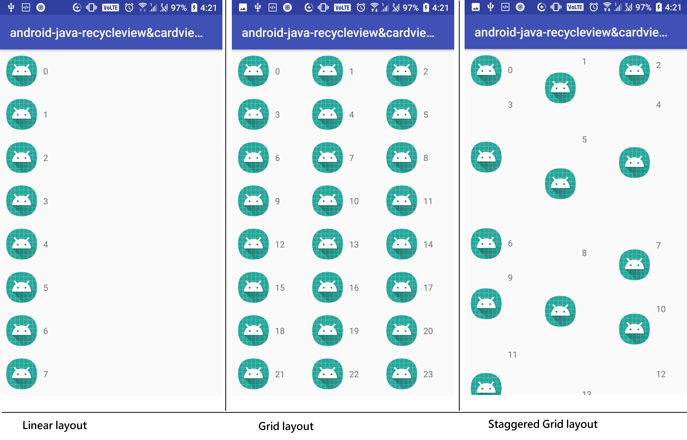

# RecyclerView & CardView

https://developer.android.com/training/material/lists-cards.html

## RecyclerView
RecyclerView 提供下列內建的版面配置管理員(layout manager)：

+ [LinearLayoutManager](https://developer.android.com/reference/android/support/v7/widget/LinearLayoutManager.html) 在垂直或水平捲動清單中顯示項目。
+ [GridLayoutManager](https://developer.android.com/reference/android/support/v7/widget/GridLayoutManager.html) 會在網格中顯示項目。
+ [StaggeredGridLayoutManager](https://developer.android.com/reference/android/support/v7/widget/StaggeredGridLayoutManager.html) 會在交錯網格中顯示項目。


## 程式碼
### 1. 加入Gradle
 一開始需要在Gradle加入這2行
```gradle
  compile 'com.android.support:cardview-v7:21.0.+'
  compile 'com.android.support:recyclerview-v7:21.0.+'
```
後面的版本請根據appcompat版本作修改才可以正常運作
```gradle
def LibVersion="{26.1.0}"

implementation 'com.android.support:appcompat-v7:${LibVersion}'

dependencies {
    ...
    compile 'com.android.support:cardview-v7:${LibVersion}'
    compile 'com.android.support:recyclerview-v7:${LibVersion}'
}
```

### 2. 在xml加入RecyclerView
```xml
<?xml version="1.0" encoding="utf-8"?>
<LinearLayout xmlns:android="http://schemas.android.com/apk/res/android"
    android:layout_width="match_parent"
    android:layout_height="match_parent">

    <android.support.v7.widget.RecyclerView
        android:id="@+id/rv_my_recycleview"
        android:layout_width="match_parent"
        android:layout_height="match_parent" />
</LinearLayout>
```

### 3. 在activity加入RecyclerView
+ RecyclerView 
+ RecyclerView.Adapter (存放資料的容器(可以是普通array或者object))
+ RecyclerView.LayoutManager (設定recyclerView的顯示方式)
```java
public class MyActivity extends Activity {
    private RecyclerView mRecyclerView;
    private RecyclerView.Adapter mAdapter;
    private RecyclerView.LayoutManager mLayoutManager;

    @Override
    protected void onCreate(Bundle savedInstanceState) {
        super.onCreate(savedInstanceState);
        setContentView(R.layout.my_activity);
        mRecyclerView = (RecyclerView) findViewById(R.id.rv_my_recycleview);

        // use this setting to improve performance if you know that changes
        // in content do not change the layout size of the RecyclerView
        mRecyclerView.setHasFixedSize(true);

        // use a linear layout manager
        mLayoutManager = new LinearLayoutManager(this);
		
		// use a Grid Layout Manager
		// mLayoutManager = new GridLayoutManager(this,defaultSpanCount);
		// use a Staggered Grid layout manager
		// mLayoutManager = new StaggeredGridLayoutManager(defaultSpanCount,StaggeredGridLayoutManager.VERTICAL);
        mRecyclerView.setLayoutManager(mLayoutManager);

        // specify an adapter (see also next example)
        mAdapter = new MyAdapter(myDataset);
        mRecyclerView.setAdapter(mAdapter);
    }
    ...
}
```

### 4. 加入adapter (決定每行item的介面)

```java
public class MyAdapter extends RecyclerView.Adapter<MyAdapter.ViewHolder> {
    private String[] mDataset; //data set,可以用arraylist<Object>

    public static class ViewHolder extends RecyclerView.ViewHolder {
        public TextView mTextView;
        public ViewHolder(TextView v) {
            super(v);
            mTextView = v;
        }
    }

	//constructor
    public MyAdapter(String[] myDataset) {
        mDataset = myDataset;
    }

	//新item
    @Override
    public MyAdapter.ViewHolder onCreateViewHolder(ViewGroup parent,
                                                   int viewType) {
        View v = LayoutInflater.from(parent.getContext())
                               .inflate(R.layout.my_text_view, parent, false);
        ViewHolder vh = new ViewHolder(v);
        return vh;
    }

	//設定每項item內容或者參數
    @Override
    public void onBindViewHolder(ViewHolder holder, int position) {
        holder.mTextView.setText(mDataset[position]);

    }
	
    @Override
    public int getItemCount() {
        return mDataset.length;
    }
}
```

### 5. 加入item點擊事件
加入到adapter中的onBindViewHolder 就可以做到item的點擊事件
```java
 @Override
        public void onBindViewHolder(ViewHolder holder,final int position) {
            //當物件顯示於畫面時被調用，可利用此方法更新該物件之內容。
            holder.mTextView.setText(mDataset.get(position));
            if(isStagger)
                holder.mTextView.setHeight(random(800,80));

            //item onClick event
            holder.itemView.setOnClickListener(new View.OnClickListener() {
                @Override
                public void onClick(View view) {
                    Toast.makeText(RecycleViewActivity.this,"Item "+mDataset.get(position)+" click ",Toast.LENGTH_SHORT).show();
                }
            });

            //item onLongClick event
            holder.itemView.setOnLongClickListener(new View.OnLongClickListener() {
                @Override
                public boolean onLongClick(View view) {
                    Toast.makeText(RecycleViewActivity.this,"Item "+mDataset.get(position)+" long click ",Toast.LENGTH_SHORT).show();
                    return false;
                }
            });
        }
```

## CardView